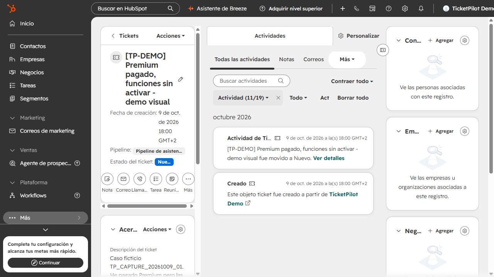
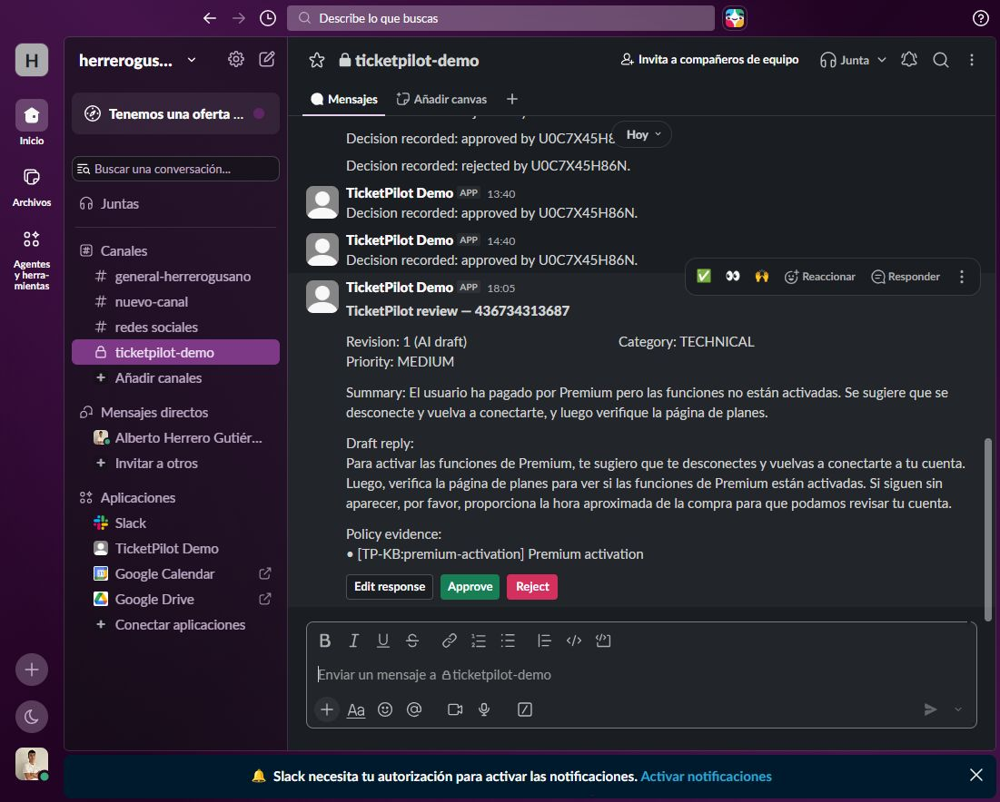
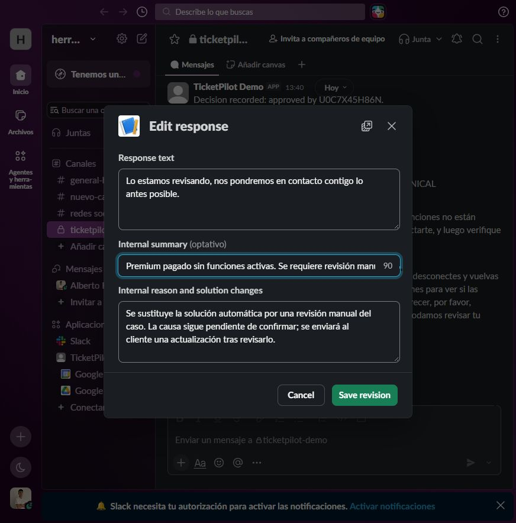
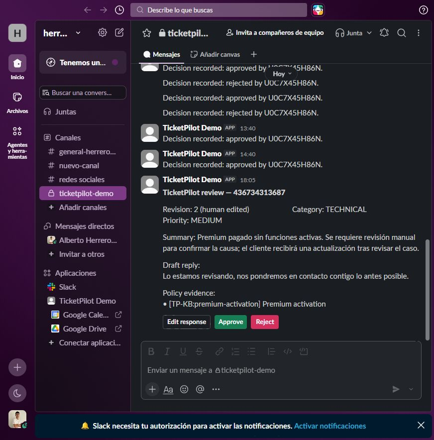
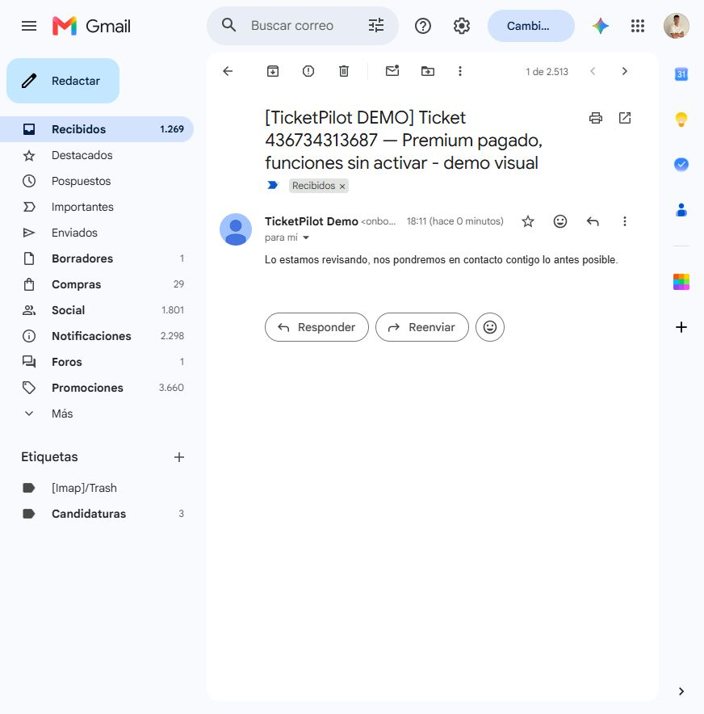
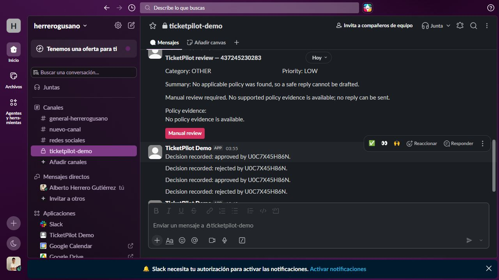
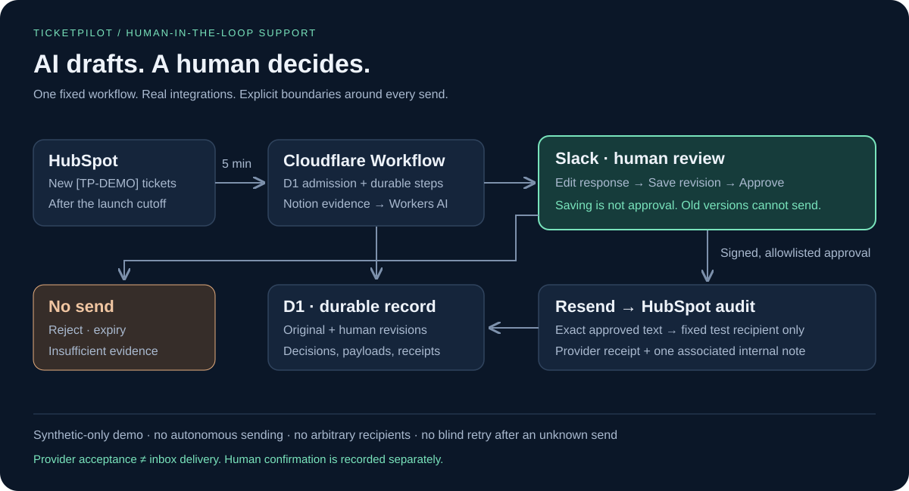

# TicketPilot

> AI drafts. A human decides. An auditable support workflow on Cloudflare.

Support teams handle repetitive questions whose safe answer depends on written policy. The hard part is keeping the evidence, human decision, outgoing reply, and audit trail connected. TicketPilot is a synthetic-only demo of that workflow: it grounds a draft in policy, requires a person to approve supported replies in Slack, and sends only to one configured test recipient.

It connects ticket intake, policy lookup, AI drafting, durable workflow state, human approval, controlled email, and a CRM audit trail.

## A real ticket, from intake to inbox

The following captures show the same synthetic ticket in the actual HubSpot and Slack interfaces.

**1. A support ticket arrives in HubSpot.** Premium has been paid for, but its features are unavailable.



**2. TicketPilot proposes a reply in Slack.** The reviewer sees the draft, internal summary and policy evidence, and can edit, approve or reject it.



**3. The reviewer changes the response.** This case is routed for manual investigation instead of sending the original troubleshooting suggestion. The internal reason records that change.



**4. Saving creates revision 2, awaiting approval.** The customer reply and internal summary now reflect the reviewer's decision. Saving has not sent an email.



**5. The owner approves the edited version in Slack.** The card is replaced by a recorded approval. [View the approval result](docs/media/live-slack-approved.jpg).

**6. The edited reply arrives in Gmail.** The subject preserves the ticket reason, and the body contains exactly the approved customer reply. Internal priority, summary and change reason stay out of the email.



All captures follow ticket 436734313687 on October 9, 2026. Read-only verification passed for approved/sent revision 2, the exact latest payload and the unique associated HubSpot audit note containing original and edited versions. Gmail was independently viewed with this particular received message open. [Capture provenance](docs/media/MEDIA.md).

## How it works

HubSpot intake runs every five minutes. Eligible tickets are claimed in D1 and processed by a Cloudflare Workflow: retrieve relevant Notion policies, generate and validate a grounded draft, and wait for a signed human decision in Slack. Approval permits controlled email and CRM auditing. Rejection, expiry or insufficient evidence sends nothing.

TicketPilot processes only synthetic `[TP-DEMO]` tickets created after the configured launch cutoff. The model cannot choose an email recipient. The backend permits sends only to the exact configured `TEST_RECIPIENT_EMAIL`, after a valid Slack Approve decision.

A reviewer can edit a supported pending reply in Slack. Saving creates an audited revision; it does not approve or send it. The refreshed card must be reviewed and explicitly approved. Only the latest approved revision can be sent. Stale buttons and forms fail closed, and editing cannot make an unsupported draft eligible. The outbound body is exactly the approved reply; the subject retains the ticket reason, demo marker, and ticket ID.



*Actual Slack provider UI for a synthetic manual-review case: insufficient policy evidence means no Approve action. This screenshot does not demonstrate the edited-reply flow or inbox delivery; see [acceptance evidence](artifacts/ACCEPTANCE.md).*

## Architecture and tradeoffs



- One TypeScript Cloudflare Worker uses native Fetch, Workflows, D1, and the Workers AI binding. Native Workflows provides durable steps and the human decision wait for this fixed process; a general agent runtime would add orchestration the workflow does not need.
- HubSpot supplies synthetic tickets and receives the audit note; Notion holds five short fictional policies; Slack provides the review surface; Resend sends only to the configured test recipient.
- Zod validates external data. Vitest and Cloudflare's testing tools cover application behavior and local D1 constraints.
- Direct bounded retrieval is sufficient for five short policies. The MVP has no vector database, frontend, MCP, extra agent runtime, queue, or separate infrastructure.

This keeps the demo small and free-tier-first while exercising real provider integrations. Free-tier availability is quota-bound and shared at the account level; sustained capacity is not guaranteed. The system is not a production customer-email service or a general answer-quality benchmark.

Slack actions are signature-checked, allowlisted, and persisted first-wins to block replay. If the email provider outcome is uncertain, the workflow records an unknown send and stops for reconciliation; it never blindly retries. Resend's 24-hour idempotency window does not promise permanent exactly-once delivery.

## Verified result

The deployed Worker health endpoint is [live](https://ticketpilot-api.herrerogusano-ticketpilot.workers.dev/health). On October 9, 2026, the latest accepted edit flow completed: the owner canceled an initial modal without saving, confirmed the original remained unchanged, then edited the summary and reply and approved revision 2 in Slack. The workflow made one send attempt, and the owner confirmed receiving the exact edited text. `verify:edit` passed checks for the stored payload hash, revision history, and associated HubSpot note.

The inbox confirmation is owner testimony, not independent mailbox telemetry. Other live scenarios include an approved-and-confirmed message, a rejection with no send, and an insufficient-evidence case with no send. See [acceptance evidence](artifacts/ACCEPTANCE.md) for source, exact identifiers, and limits.

Supervisor review recorded 149 tests across 21 files and 85.50% domain/adapter branch coverage. GitHub CI and deployment checks passed, including migration, deployment, and health verification. Exact release and acceptance records are in [the evidence report](artifacts/ACCEPTANCE.md); these results do not promise future quota or delivery performance.

## Run locally

Use Node.js 24 and npm. Dependencies are pinned in `package-lock.json`.

```sh
npm ci
npm run generate:types
npm run typecheck
npm run lint
npm test
npm run db:migrate:local
npx wrangler dev
```

Copy `.dev.vars.example` to an ignored `.dev.vars` only on a nonsynced, access-restricted machine, or provide secrets through a protected process environment. Never put credentials in Git, logs, chat, or synced notes. The Windows operator setup uses current-user DPAPI storage outside this repository; it is not required for local development.

Preflight and seed scripts default to read-only or dry-run behavior. Use `npm run preflight -- --help`, `npm run seed:hubspot`, and `npm run seed:notion -- --help` before any optional write mode. Preserve ignored seed manifests to reconcile reruns and uncertain creation outcomes.

With protected demo credentials configured, additional checks are:

```sh
npm run test:integration
npm run test:coverage
npm run smoke
npm run security:audit
npm run verify:e2e
npm run verify:edit -- --ticket <synthetic-ticket-id>
```

These commands have distinct evidence boundaries: integration tests use controlled external providers; smoke performs read-only provider checks plus an unsigned-action rejection; `verify:edit` reads persisted provider state and the associated note; `verify:e2e` checks scenario outcomes and separately recorded human acceptance. A signed simulator event is not a physical Slack action, provider acceptance is not inbox delivery, and only actual owner confirmation supports an inbox-confirmed claim. See [the demo guide](docs/DEMO.md) and [operations guide](docs/OPERATIONS.md).

## Project map

- [PLAN.md](PLAN.md) — implementation and acceptance contract
- [docs/DEMO.md](docs/DEMO.md) — product walkthrough and evidence language
- [docs/OPERATIONS.md](docs/OPERATIONS.md) — deployment, reconciliation, and safe operation
- [artifacts/ACCEPTANCE.md](artifacts/ACCEPTANCE.md) — live, simulated, and human evidence
- [AGENTS.md](AGENTS.md) — execution and safety contract
