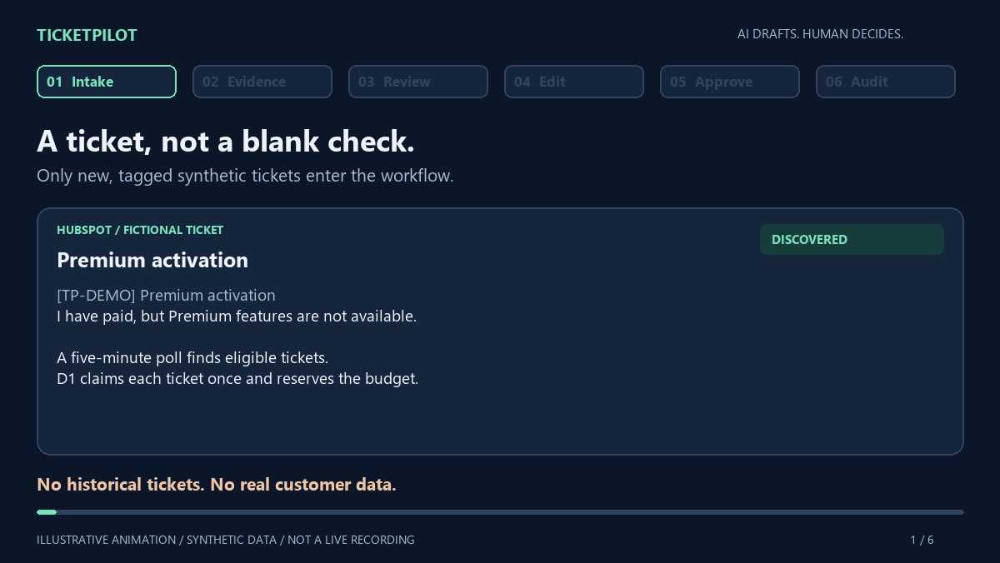

# Demo walkthrough

TicketPilot demonstrates a small support workflow using fictional HubSpot tickets, five fictional Notion policies, one Slack reviewer, and the Resend account owner's test mailbox. It never emails a ticket contact.


*Architecture overview. See [media provenance](media/MEDIA.md) for context.*



*Illustrative animation, not a provider-dashboard screencast or evidence of a live action.*

[Watch or download the 24-second MP4](media/walkthrough.mp4). The animation compresses timing; actual ticket intake uses the five-minute poll.

## Walkthrough

The five seeded examples cover premium activation, duplicate charge, CSV export, an expired password-reset link, and an unrelated office-parking question. Only `[TP-DEMO]` tickets created after the configured launch cutoff are eligible. Check [acceptance evidence](../artifacts/ACCEPTANCE.md) before presenting; it identifies what was live, simulated, or owner-confirmed.

For a supported proposal, show the linked Notion evidence, bounded draft, and category/priority in Slack. The reviewer may:

1. Choose **Edit response** and change the customer reply and, if needed, the internal summary.
2. Enter an internal change reason and save. Saving creates a new audited revision; it neither approves nor sends. Canceling without saving leaves the proposal unchanged.
3. Review the refreshed Slack card, then explicitly choose **Approve** for that latest revision. Only the latest approved revision may be sent. Stale buttons or forms fail closed; after a decision or send reservation, editing is locked.

The edit controls allow up to three saved edits, with a reply up to 1,500 characters, summary up to 240, and reason up to 200. A human edit is not a new model inference or automatic policy validation. The reviewer should check changed solutions against the cited policies. Editing cannot make an unsupported proposal sendable.

On approval, the outbound email body is exactly the approved reply. The subject includes the sanitized ticket reason, demo marker, and ticket ID. Internal summary, category, priority, and policy metadata are not appended to the email. The associated HubSpot audit note records the proposal and edit history, approved revision, sent text, and provider receipt. D1 retains revision history after transient events expire.

For a rejection, verify the durable first decision and zero send attempts. For insufficient policy evidence, show the manual-review state and absence of an Approve action. Neither a repeated callback nor a stale Slack action can replace a first decision or cause another send.

## Accepted live edit example

The edit flow has completed live acceptance on synthetic ticket `436854994147`. The owner first canceled the Slack edit modal without saving and confirmed that the original proposal remained unchanged. The owner then changed the internal summary and customer reply, saved the edit, reviewed the refreshed card, and physically approved revision 2 in Slack. The workflow completed with one send attempt, and the owner confirmed receiving the email with the exact edited text.

`npm run verify:edit -- --ticket 436854994147` passed against the actual stored payload hash and revision history and the unique associated HubSpot note. That note is `526142307576`; the Resend receipt is `01a120b2-c000-7d35-9942-ad1a2b4c7e52`; the decision timestamp is `2026-10-09T12:45:44.256Z`. The inbox evidence is labeled `owner_chat_confirmation` and bound to that ticket, receipt, and decision time. It is owner testimony, not independent mailbox telemetry. The verifier itself confirms provider state and the associated note; it cannot attest who clicked in Slack or whether the message appeared in a mailbox.

The associated note is the best place to inspect original-versus-edited text, change reason, editor and timestamps, approved revision/hash, exact sent text, and receipt. The Slack message is in the [demo channel](https://app.slack.com/client/T0C7S09984V/C0C7X4Y182E). Do not click or replay a completed operation to generate another email.

## Other accepted scenarios

Recorded provider-backed scenarios include a supported approval with one accepted email and verified HubSpot note, a rejection with zero sends, and an insufficient-evidence manual case with no send. The owner also physically approved Premium and rejected a password-reset proposal in Slack; the particular approved Premium email was confirmed received. These scenarios are described in [the acceptance report](../artifacts/ACCEPTANCE.md). A signed simulator callback is integration evidence, not a physical Slack click. A Resend success response means provider accepted, not inbox delivered.

Current immutable English-input drafts are in Spanish. This is a recorded limitation, not a measured language-quality guarantee.

## Rechecking evidence

With protected demo credentials and Wrangler authentication configured, run:

```sh
npm run verify:edit -- --ticket 436854994147
npm run verify:e2e
```

`verify:edit` checks the persisted send payload against its revision and directly checks the unique associated HubSpot note. `verify:e2e` checks the five original scenarios and their separately recorded human/inbox evidence; it is not a substitute for `verify:edit`. Missing evidence produces a pending report and nonzero exit. An owner may record human evidence only after actually performing the Slack action and checking the particular email. Do not reset quotas, delete seed manifests, restart a completed sending Workflow, or replay an accepted or ambiguous send to prepare a presentation.

For a clean demo, show the HubSpot synthetic ticket and audit note, the cited Notion policy, the Slack review and revision, and sanitized Workflow/D1 state. If showing a mailbox, mask the recipient address. See [OPERATIONS.md](OPERATIONS.md) for reconciliation and safe operation.
